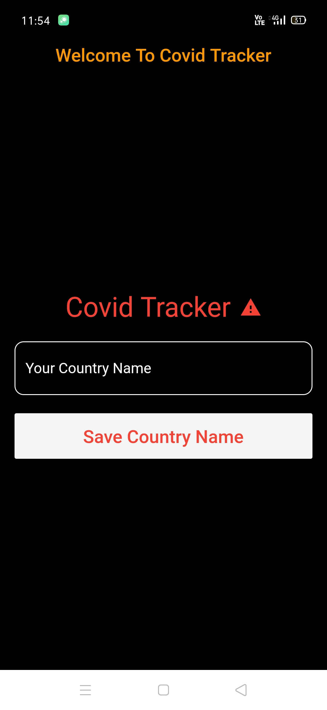
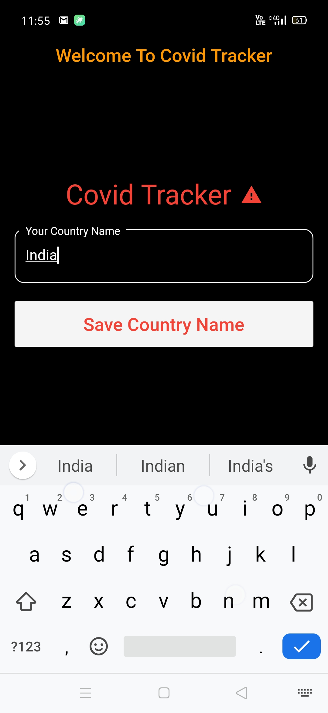

# Covid19-Tracker

### Covid Tracker is a flutter project made for keeping ourself updated about the coronovirus

### When You first time launch the app - 

### Preview of the App (Part 1)

### Preview of the App (Part 2)(on pressing the map button which you saw in the above video at bottom right corner)

